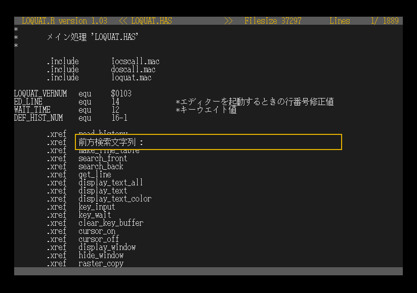

# LOQUAT.R
X680x0で動作するテキストファイルビュワーです。   
動作が軽いのと、ファイルの最終参照位置を記憶するヒストリ機能があるのが特徴です。   
[](./images/loquat.png)
## 使用方法
以下の形式で起動できます。
```
LOQUAT -[switches] ファイル名
```
キーの配置は以下となります。
|  キー  |  起動機能  |
| ---- | ---- |
|  ↑↓  |  上下へ高速スクロール  |
|  ←→  |  上下へ低速スクロール  |
|  ROLL-DOWN  |  上へ画面スクロール  |
|  ROLL-UP  |  下へ画面スクロール  |
|  HOME,F1  |  先頭画面へスクロール  |
|  DEL,F2  |  最終画面へスクロール  |
|  F4  |  前方検索  |
|  F5  |  前方次検索  |
|  F6,SHIFT+F4  |  後方検索  |
|  F7,SHIFT+F5  |  後方次検索  |
|  F10  |  行番号指定  |
|  E  |  エディタ起動  |
|  ESC,RET,UNDO  |  終了  |

エディタを起動するためには、環境変数LOQ_EDに対して、対象のエディタの実行ファイル名と指定行を表示するスイッチを指定する必要があります。本プログラムではLOQ_EDで指定された内容に対して行番号を付与してプログラムを起動します。以下に例を記載します。

ED.Rの場合
```
LOQ_ED=ed.r -n
```
EMACSの場合
```
LOQ_ED=em.x -g
```

スイッチは以下が指定可能です。
| &nbsp;&nbsp;&nbsp;&nbsp;switch&nbsp;&nbsp;&nbsp;&nbsp; | 説明 |
| ---- | ---- |
|  -P[str]  |  画面の表示色を指定します。カンマ区切りで以下の順番にHEX形式で指定します。<br/>1. 背景色<br/>2. ヘッダ部分の文字色<br/>3. ヘッダ/フッタ部分の背景色<br/>4. テキスト表示部分の文字色<br/>デフォルトと同じ色を指定する場合は以下の指定となります。<br/>-P2108,c7c0,6318,fffe<br/>環境変数LOQ_COLORに指定しても同様の動作となります。  |
|  -N[num]  |  指定した行から表示を開始します。  |
|  -L  |  常駐します。ヒストリ機能を使用するためには、常駐させる必要があります。  |
|  -R  |  常駐解除します。  |
|  -F[num]  |  常駐時に行番号を記憶するファイル数を指定します。無指定の場合は16がデフォルト値となります。指定可能な範囲は1～2048となります。また、ファイル1つにつき、264byteのメモリを消費します。  |
|  -I  |  ヒストリーバッファを初期化します。  |

## ビルド方法
ビルドはyosshinさんの[xdev68k](https://github.com/yosshin4004/xdev68k)を使用させていただいています。
また、本プログラムはリロケータブル形式(*.R)に変換するため、xdev68k/x68k_binにCV.Xをコピーしておく必要があります。

xdev68kの環境構築後に、bashコンソールで以下を実行してください。
```
cd src
make
```

また、X680x0上では、以下でビルドが可能です。makeはGNU make 3.62で確認をしています。
```
cd src
make -f makefile.x68k
```

## ライセンス
LOQUATはMITライセンスを適用しています。